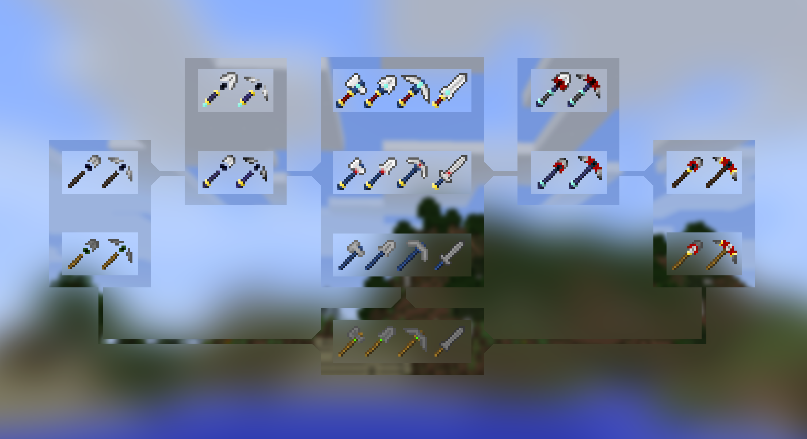

# Ancient Toolbox Minecraft Mod (1.7.10)
This mod introduced a few new tool sets with (back then) weird mechanics like soul and block consumption, tiers within tool sets as well as the option to combine sets.
It was a neat little experiment and it was enjoyable to play with on our private servers. By now I outgrew the game and the mod has long been abandoned since then.
[The original forum post](http://www.minecraftforum.net/forums/mapping-and-modding/minecraft-mods/wip-mods/2518690-ancient-toolbox-toolsets-a-bit-different) has been lost in the ether by now due to multiple management changes on the site and this repository serves as an archive.

## License
All of the source code and textures is licensed under [CC BY-NC-SA 4.0](http://creativecommons.org/licenses/by-nc-sa/4.0/)
